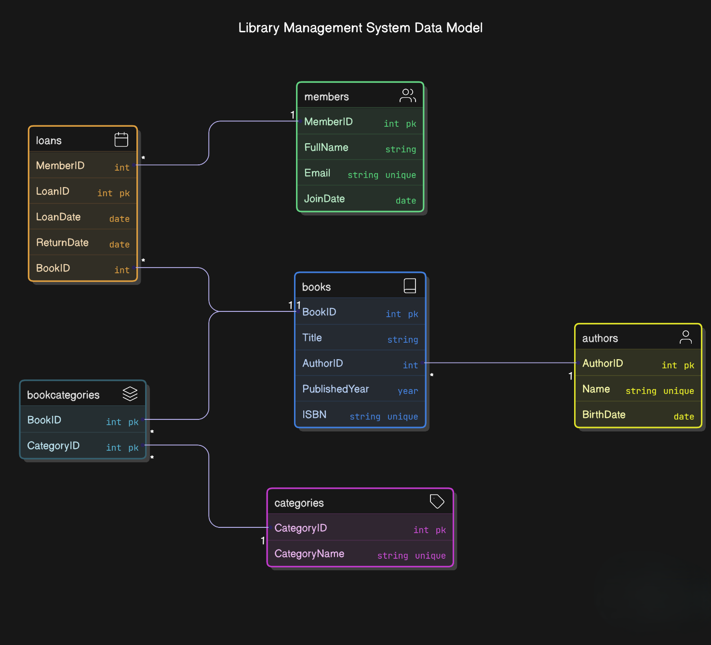

# MySQL Database Management System Project

## Project Title
MySQL Database Management System for Library Management

## Description
This project implements a complete database management system for a library. It allows for the management of books, authors, members, and loans. The database schema is designed to efficiently handle relationships between these entities, ensuring data integrity and supporting various operations such as adding new books, registering members, and tracking book loans.

## How to Run/Setup the Project
1. Ensure you have MySQL installed on your machine.
2. Open your MySQL command line or a MySQL client (like MySQL Workbench).
3. Create a new database using the following command:
   ```sql
   CREATE DATABASE library_management;
   ```
4. Use the newly created database:
   ```sql
   USE library_management;
   ```
5. Import the SQL schema by executing the contents of the `sql/database_schema.sql` file. You can do this by running:
   ```sql
   SOURCE path/to/sql/database_schema.sql;
   ```
   Replace `path/to/` with the actual path to your SQL file.

## Entity-Relationship Diagram (ERD)
 